# Pokemon Deck

Este projeto é um CRUD para criação de baralhos de Pokémon, utilizando a API PokemonTCG. Ele permite aos usuários criar, visualizar, atualizar e excluir baralhos de Pokémon, além de gerenciar as cartas em cada baralho.

Todos os baralhos criados estão sendo salvos no local storage da máquina.

## Tecnologias Utilizadas

- Angular 16
- Tailwind CSS
- Ignite UI (Infragistics)

## Estrutura do Projeto

<pre>
📦 src
┣ 📂 app
┃ ┣ 📂 @core
┃ ┃ ┣ 📂 constants
┃ ┃ ┃ ┗ 📜 [arquivos de constantes]
┃ ┃ ┗ 📂 interfaces
┃ ┃   ┗ 📜 [arquivos de interfaces]
┃ ┣ 📂 @shared
┃ ┃ ┣ 📂 components
┃ ┃ ┃ ┣ 📂 go-to-home
┃ ┃ ┃   ┗ 📜 [componente para navegação para a página inicial]
┃ ┃ ┃ ┣ 📂 loader
┃ ┃ ┃   ┗ 📜 [componente para exibição de loader]
┃ ┃ ┃ ┣ 📂 title
┃ ┃ ┃   ┗ 📜 [componente para exibição de título]
┃ ┃ ┃ ┗ 📂 toast
┃ ┃ ┃   ┗ 📜 [componente para exibição de toast]
┃ ┃ ┣ 📂 enums
┃ ┃ ┃ ┗ 📜 [arquivos de enums]
┃ ┃ ┣ 📂 functions
┃ ┃ ┃ ┣ 📂 validators
┃ ┃ ┃   ┗ 📜 [arquivos de funções de validação]
┃ ┃ ┣ 📂 guards
┃ ┃ ┃   ┗ 📜 [arquivos de guards]
┃ ┃ ┣ 📂 interfaces
┃ ┃ ┃  ┗ 📜 [arquivos de interfaces compartilhadas]
┃ ┃ ┗ 📂 services
┃ ┃   ┗ 📜 [arquivos de serviços compartilhados]
┃ ┣ 📂 create
┃ ┃ ┗ 📜 [arquivos relacionados à criação de baralhos]
┃ ┣ 📂 home
┃ ┃ ┗ 📜 [arquivos relacionados à página inicial]
┃ ┣ 📂 list
┃ ┃ ┗ 📜 [arquivos relacionados à lista de baralhos]
┣ 📂 assets
┃ ┗ 📜 [arquivos de assets]
┣ 📂 environments
┃ ┗ 📜 [arquivos de configuração de ambiente]
</pre>

## Telas e Funcionalidades

### Página Inícial (`home.component.ts` | `http://localhost:4200/`):

> Tela de entrada do projeto contendo a logo personalizada e 2 botões de redirecionamento sendo eles: **_Meus baralhos_** e **_Criar baralho_**. O botão que vai para a tela de listagem dos baralhos criado fica desabilitado enquanto você não possuir uma coleção.

**Quando usuário não possui baralhos criados:**
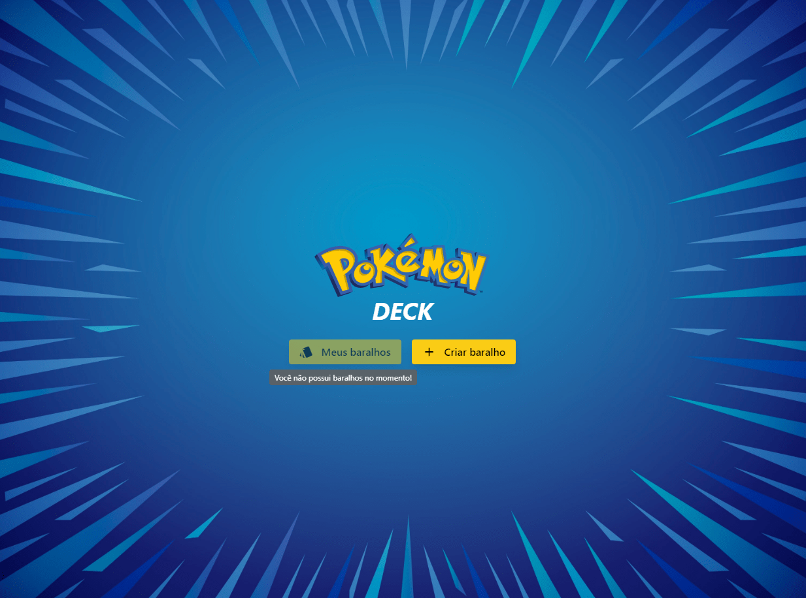

**Quando o usuário possui baralhos criados:**
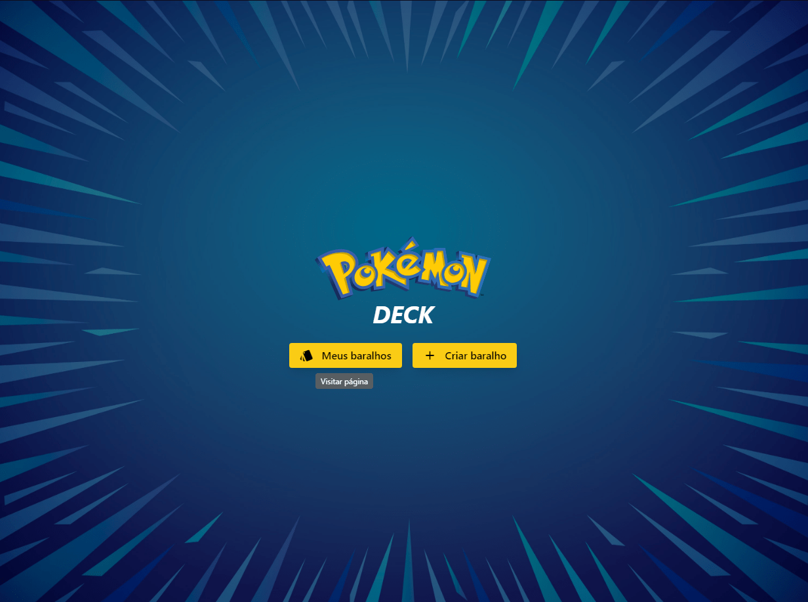

### Página de Criação de Baralho (`create.component.ts` | `http://localhost:4200/create`):

> Tela principal do projeto contendo um formulário básico para definir o baralho.
>
> - **_Requisitos do baralho_**: Nome; Mínimo 24 cartas; Máximo 60 cartas; Até 4 cartas com o mesmo nome (Todos os valores podem ser alterados em `src/app/@core/constants/deck-rules.ts`).
> - Input [TEXT] **_Nome do baralho (required)_**: Define um nome para o baralho;
> - Select **_Página de cartas_**: Seleciona a página de cartas que você gostaria de visualizar (consulta a API do PokemonTCG quando página não foi visitada ainda, se a página selecionada já foi escolhida anteriormente apenas carrega as cartas da respectiva página, para otimização de performance);
> - **_Lista de cartas_**: Espaço reservado para o usuário clicar nas cartas que deseja incluir em seu baralho,

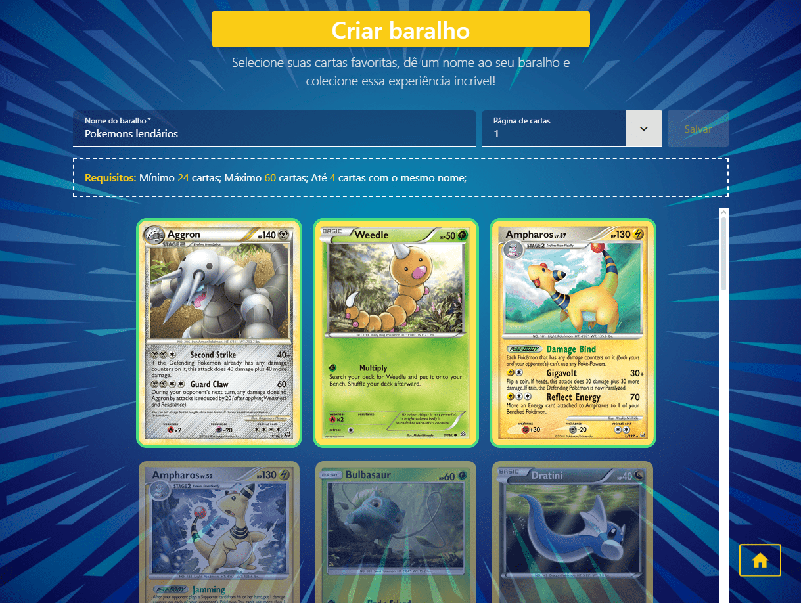

### Página de Edição de Baralho (`create.component.ts` | `http://localhost:4200/update/:ID`):

> Mesmo componente utilizado na tela de listagem, porém adaptado para receber um ID de um baralho criado para que seja realizada alterações se necessário. Trás os dados atuais do baralho (Nome preenchido e Cartas selecionadas) e permite o usuário atualiza-lo.

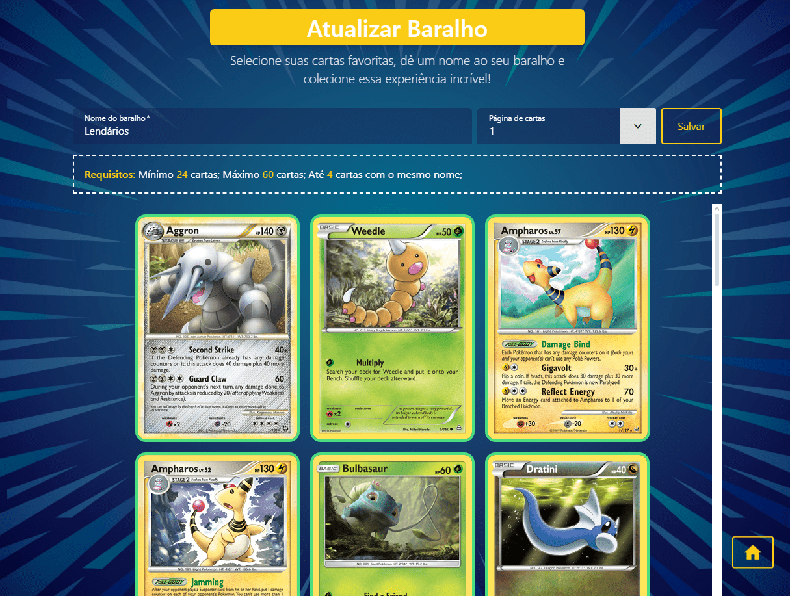

### Página de Listagem de Baralhos Criados (`list.component.ts` | `http://localhost:4200/list`):

> Tela de listagem contendo os baralhos criados anteriormente, podemos clicar em cada baralho para visualizar seus detalhes, editar ou apaga-lo.

**Baralhos criados**
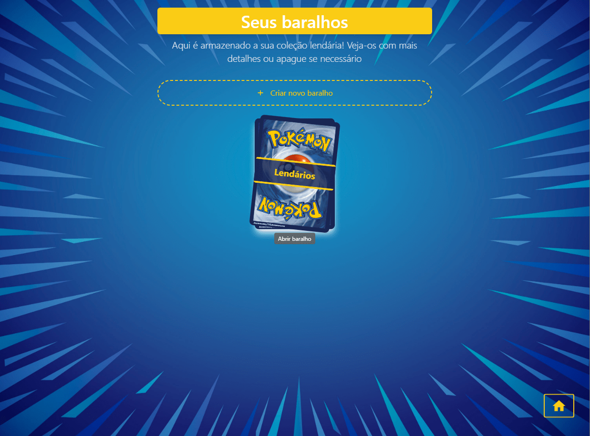

**Detalhes do baralho**
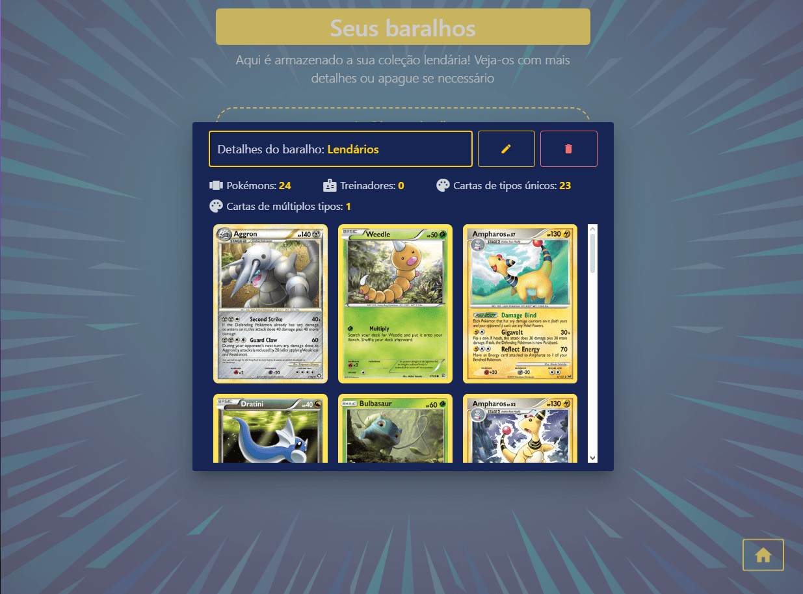

**Exclusão de baralho**
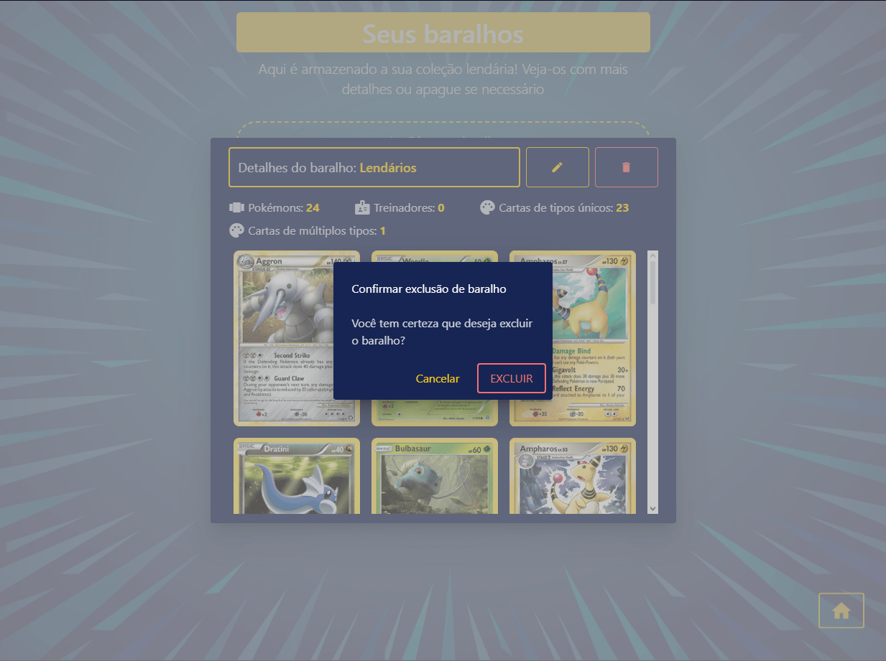

**Edição de baralho**

> Quando clicar será redirecionado para a [Página de Edição de Baralho](#página-de-edição-de-baralho-createcomponentts--httplocalhost4200updateid)

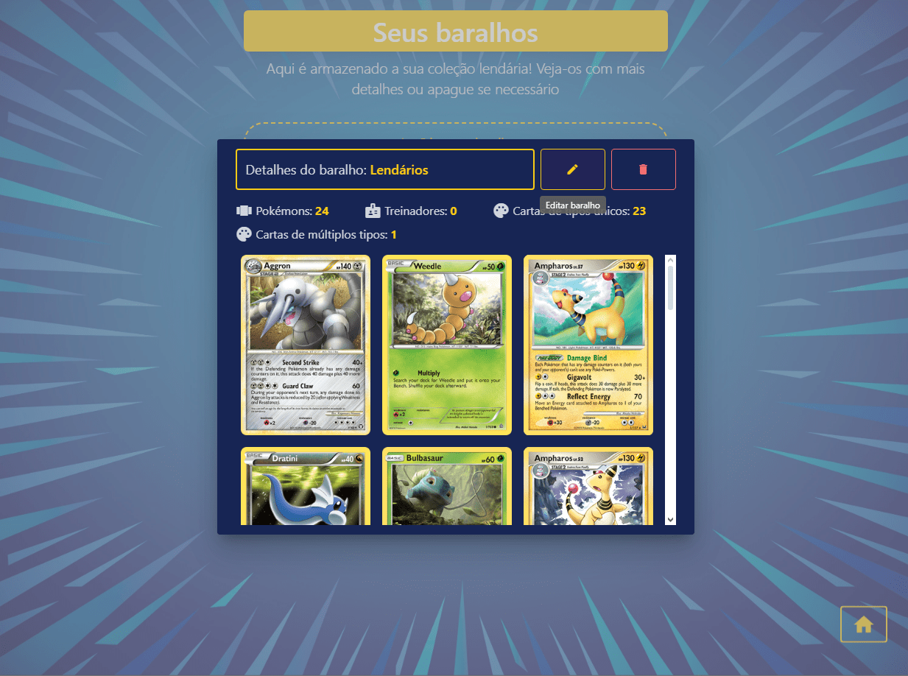

### Componentes compartilhados

**Loader**

> Texto exibido é dinâmico e pode ser alterado.

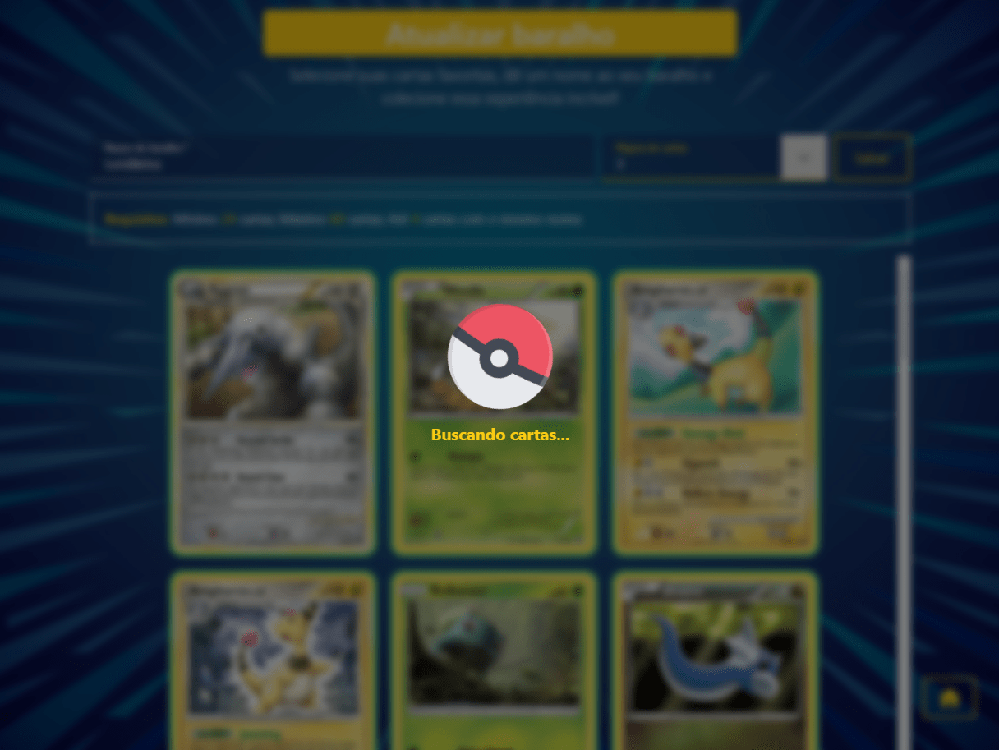

**Go to home**

> Botão disponível em todas as telas que não forem a inicial, pois ao clicar redireciona para a raiz.

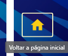

**Toast**

> Mensagem exibida é dinâmica e pode ser alterada.

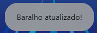
